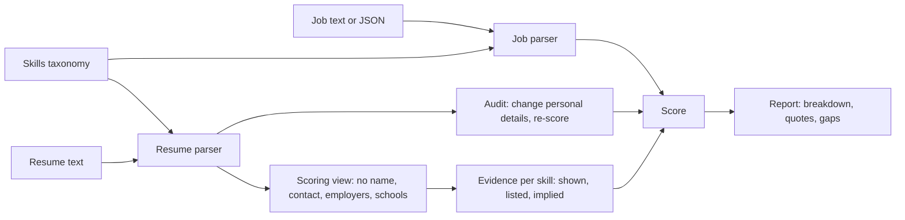

# Resume Job Matching Agent

Give it a resume and a job description and it tells you how well they fit, and shows its working. Every point of
the score traces back to a quote from the resume or to a skill the resume never shows. It also ranks a folder of
candidates for one job, ranks a folder of jobs for one candidate, reviews a resume for the things that trip up
recruiters and applicant tracking systems, and can prove that names, schools, employers and other personal
details did not change a score.

It does not decide anything about a person. It gives a hiring manager or a job seeker something concrete to
check.

## What it does

| Command | Purpose |
| ------- | ------- |
| `match` | Score one resume against one job with a breakdown, per-requirement evidence and a list of gaps |
| `rank-candidates` | Rank a folder of resumes for one job |
| `rank-jobs` | Rank a folder of jobs for one resume |
| `analyze` | Review a resume: contact details, sections, dates, gaps, numbers, vague openers, keyword gaps for a job |
| `audit` | Change only personal attributes in a resume and report whether the score moved |
| `skills` | List or search the skills taxonomy |
| `parse` | Show how a resume or job file was read (personal contact fields are left out) |



## Quick start

Requires Python 3.10 or newer.

```bash
python -m venv .venv && source .venv/bin/activate     # Windows: .venv\Scripts\activate
python -m pip install -e ".[dev]"

jobmatch match configs/samples/resumes/avery-backend.md configs/samples/jobs/senior-backend-engineer.md
jobmatch rank-candidates configs/samples/resumes configs/samples/jobs/senior-backend-engineer.md
jobmatch audit configs/samples/resumes/casey-data.md configs/samples/jobs/ml-engineer.json
```

The sample resumes and jobs are invented. Resumes are `.txt` or `.md`. Jobs are `.txt`, `.md`, `.json` or
`.yaml`. Pass `--as-of 2026-09-19` to pin the reference date so results do not drift as time passes.

### Example: one match

```text
# Match: avery-backend for Senior Backend Engineer

**Score 93 of 100, strong match.** 9.3 years of dated experience shown.

| Component | Score | Weight | Detail |
| --- | ---: | ---: | --- |
| must-have skills | 94 | 0.55 | 5 of 5 required skills shown |
| nice-to-have skills | 80 | 0.15 | 3 of 3 preferred skills shown |
| experience | 100 | 0.15 | 9.3 years in relevant roles, 5 asked |
| seniority | 100 | 0.1 | lead or principal level shown, senior asked |

| Skill | Priority | Status | Strength | Evidence |
| --- | --- | --- | ---: | --- |
| Python | must | shown in role | 100 | `Built payment APIs in Python and FastAPI handling 1,200 requests per second on AWS.` |
| REST APIs | must | shown in role | 70 | `Developed REST services in Python and Django for 30 enterprise customers.` |
| Kubernetes | must | shown in role | 100 | `Moved 14 services to Kubernetes with Terraform, cutting deploy time from 40 to 6 minutes.` |
| Kafka | nice | listed only | 40 | - |
```

REST APIs score 70 because the role that shows it ended in 2021, more than five years ago. Kafka is only in the
skills list, so it earns 40 percent of what a shown skill would.

### Example: ranking five candidates

```text
| Rank | Name | Score | Match | Missing required |
| ---: | --- | ---: | --- | --- |
| 1 | avery-backend | 93 | strong | - |
| 2 | casey-data | 58 | possible | REST APIs, PostgreSQL |
| 3 | devon-keywords | 33 | weak | REST APIs |
| 4 | emery-frontend | 15 | weak | Python, PostgreSQL, AWS, Kubernetes |
| 5 | blake-junior | 5 | weak | REST APIs, PostgreSQL, AWS, Kubernetes |
```

`devon-keywords` lists sixteen technologies and has eight years of office administration. It scores 33 because
none of those skills appear in any role, and its review says so:

```text
- **warning**: 0 of 2 bullets contain a number or measurement. Add scale, speed, cost or volume where you can state it accurately.
- **info**: 16 skills are listed but never used in a role bullet. Show at least the important ones in context.
- **info**: 2 skills in the job do not appear on the resume. Add one only if you have really used it.
```

### Example: the invariance audit

```text
# Invariance audit: casey-data for ml-engineer

**PASS.** Baseline score 93. Largest change 0.

| Change to the resume | Score | Delta |
| --- | ---: | ---: |
| name changed to Priya Raman | 93 | +0 |
| name changed to Tunde Bakare | 93 | +0 |
| email and phone replaced | 93 | +0 |
| employer names replaced | 93 | +0 |
| school names replaced | 93 | +0 |
| graduation years shifted by 7 | 93 | +0 |
| personal attributes added to header | 93 | +0 |

The original resume mentions date of birth, marital status.
```

## How the score works

The score is `100 * sum(weight * component) / sum(weight)` over the components a job actually specifies.

| Component | Weight | What it measures |
| --------- | ------ | ---------------- |
| Must-have skills | 0.55 | Average strength across the required skills |
| Nice-to-have skills | 0.15 | Average strength across the preferred skills |
| Experience | 0.15 | Years in roles that show a wanted skill, against the years asked |
| Seniority | 0.10 | Level from years and the most recent title, against the level asked |
| Education | 0.05 | Highest degree, against the degree asked |

A job with no education requirement does not reward or punish education, and the other weights renormalise.
Being more senior or more educated than asked is never penalised.

Skill strength comes from evidence:

| Status | Meaning | Strength |
| ------ | ------- | -------- |
| shown in role | Named in a role title or bullet | 1.0, or 0.85 and 0.7 if last used more than two and five years ago |
| implied | A shown skill implies it (Kubernetes implies containers, Flask implies Python) | 0.8 of the source |
| listed only | In a skills list, summary or certification but not in any role | 0.4 |
| related only | A neighbour skill (PostgreSQL when MySQL is asked) | 0.35 of the source, and never counts as met |
| not shown | No evidence | 0 |

When a job asks for years of a skill and the resume shows fewer, the strength is reduced in proportion (never
below half). A match is labelled `strong` at 75 and above with no missing must-have, `weak` below 50, and
`possible` otherwise. All weights, factors and thresholds are in [`configs/policy.example.yaml`](configs/policy.example.yaml).

## Fairness

Scoring reads a restricted view of the resume. The name, contact details, employer names, school names and
detected personal attributes (date of birth, age, marital status, gender, nationality, religion, photo) are
removed first. `audit` then checks the claim: it re-parses and re-scores variants with different names, contact
details, employers, schools and graduation years, and with personal attributes added, and exits 1 if any score
differs. Run it on your own data before you trust it.

What this does not do: it cannot remove bias in the job description, in which skills a person's role bullets
happen to mention, or in the taxonomy's aliases. Treat a score as a prompt for a person to look, not a
decision.

## Input formats

Resume text uses ordinary headings (`Summary`, `Experience`, `Skills`, `Education`, `Certifications`, `Projects`)
with or without `#`, and a role header with a date range such as `Senior Engineer, Acme (Jan 2020 - Present)`.
Bullets can use `-`, `*`, `•` or numbers. Dates can be `Jan 2020`, `January 2020`, `01/2020` or `2020`.

Job text uses headings like `Requirements` and `Nice to have`. Lines with cues such as "preferred" or "is a
plus" count as nice-to-have. A line such as "3 years of Spark" attaches the years to that skill, and
"5+ years of experience" applies to the whole role. Structured jobs skip the guesswork:

```json
{"title": "Machine Learning Engineer", "must": ["python", "ml:3", "pytorch"], "nice": ["spark"],
 "min_years": 4, "seniority": "senior", "education": "bachelor"}
```

Add your own skills with a YAML file (see [`configs/taxonomy.example.yaml`](configs/taxonomy.example.yaml)) and
set `JOBMATCH_TAXONOMY_FILE`.

## Commands

| Command | Notes |
| ------- | ----- |
| `match RESUME JOB [--summary] [--min-score N] [--format md,json] [--output FILE]` | `--min-score 60` exits 1 below that score |
| `rank-candidates DIR JOB [--top N] [--format md,json,csv]` | Ties break on fewer missing must-haves, then id |
| `rank-jobs RESUME DIR [--top N] [--format md,json,csv]` | |
| `analyze RESUME [--job JOB] [--format md,json]` | With a job it also lists missing keywords |
| `audit RESUME JOB [--format md,json]` | Exits 1 if any variant scores differently |
| `skills [QUERY]` | The taxonomy has 90 skills |
| `parse resume\|job FILE` | JSON of what was read |

Global option: `--as-of YYYY-MM-DD`. Exit codes: 0 success, 1 a gate failed, 2 invalid input.

## Configuration

Settings come from `JOBMATCH_*` environment variables or a `.env` file. See [`.env.example`](.env.example).
Optional model-written summaries (`--summary`) use OpenAI or Anthropic and receive only the job title, score,
counts and skill names. Without a provider a deterministic summary is used. The provider is chosen with
`JOBMATCH_LLM_PROVIDER` (`none`, `openai` or `anthropic`); the matching API key is the only required variable
for that provider, and everything else has a default.

## Development

```bash
make lint        # ruff check and format check
make typecheck   # mypy --strict
make cov         # pytest with an 80% coverage gate (currently about 98%)
make audit       # pip-audit on requirements.txt
docker build -t resume-job-matching-agent . && docker run --rm -v "$PWD:/data" resume-job-matching-agent match /data/cv.md /data/job.md
```

Documentation: [architecture](docs/architecture.md), [decisions](docs/adr/), [security](SECURITY.md),
[contributing](CONTRIBUTING.md), [changelog](CHANGELOG.md).

## Limitations

- **Plain text only.** Resumes must be `.txt` or `.md`. PDF and Word files are rejected, not converted. Text
  copied out of a two-column PDF often loses its order, which weakens role and date detection.
- **Heuristic parsing.** A role header without a date range is only recognised as the first role, and other
  undated headers become bullets of the role above. Unusual layouts lose fields. `parse` and `analyze` show what
  was read.
- **The taxonomy is small and technical.** It has 90 skills, weighted toward software, data and security. For
  other fields, add skills or the tool will report nothing to score. It matches words, so a skill described
  in unusual words is missed, and a mention in a bullet counts as use even if the person only touched it.
- **Ambiguous names.** `Go` is matched with a capital G only, and negations such as "no Java experience" are
  ignored, but other ambiguous words can still produce a false hit.
- **Years are estimated from dates.** A role that shows a skill counts as years of that skill for its whole
  duration, and a bare year is read as January (start) or December (end).
- **Fairness is bounded.** The audit tests what the scorer reads. It cannot see bias in the job text, in the
  taxonomy, or in who writes resumes in which style. Scores should support a human decision, and depending on
  where you hire, automated screening may need its own legal review.
- **English only.**

## License

MIT. See [LICENSE](LICENSE).
