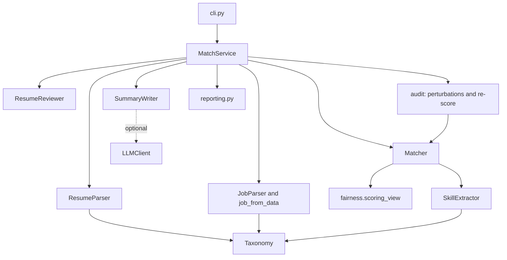

# Architecture

## Overview

`jobmatch` is a stateless batch tool. It parses a resume and a job into models, extracts evidence for each
skill, scores the match from a restricted view of the resume and renders a report. The composition root
(`container.build_service`) chooses the summary writer, and `MatchService` is the facade used by the CLI and by
library callers. The taxonomy and the policy are plain inputs, so callers can supply their own.

## Modules

| Module | Responsibility |
| ------ | -------------- |
| `models.py` | `Skill`, `Role`, `Resume`, `Job`, `SkillEvidence`, `MatchResult`, `ResumeReview`, `InvarianceReport` |
| `taxonomy.py` | Skill names, aliases, implied and related skills, mention detection, YAML overrides |
| `dates.py` | Date and date-range parsing |
| `parsers.py` | Resume and job parsers, structured job files, degree and seniority detection |
| `extract.py` | Evidence per skill, merged years, implied and related skills, relevant years |
| `matching.py` | Components, weights, labels and the notes shown to a reader |
| `fairness.py` | The scoring view and the perturbations used by the audit |
| `analysis.py` | Resume quality review |
| `config.py` | Settings and the scoring `Policy` |
| `summary.py` | Template and grounded model-backed summary writers |
| `reporting.py` | Markdown, JSON and CSV rendering with escaping |
| `service.py` | File loading with limits, ranking, review, audit |
| `security.py` | Secret redaction, escaping helpers and PII scrubbing |
| `providers/` | HTTP client with retries and OpenAI and Anthropic chat clients |

## Data flow

1. **Parse.** The resume parser splits sections, reads roles and their date ranges, and lists skills. Unknown
   layouts degrade to fewer fields instead of failing. The job parser separates must-have, nice-to-have and
   context skills by section headings and cue phrases, and reads years and degree requirements.
2. **Extract.** Mentions in role titles and bullets become demonstrated evidence with a quote and merged years.
   Mentions in skills lists, the summary and certifications become listed evidence. Implied and related skills
   are derived from the taxonomy.
3. **Score.** `scoring_view` removes personal data. Each requirement gets a status and a strength, and the
   components combine as described in ADR 0003.
4. **Report.** Every value from a document passes through an escaping helper. Quotes are scrubbed of e-mail
   addresses, phone numbers and links first.

## Extending

- New skills: the taxonomy list, or a YAML file via `JOBMATCH_TAXONOMY_FILE`.
- New thresholds or weights: a `Policy` field with a test that shows it changes the outcome.
- New output format: a function in `reporting.py` and a choice in the CLI.
- Different summary writer: implement `SummaryWriter` and pass it to `build_service`.
